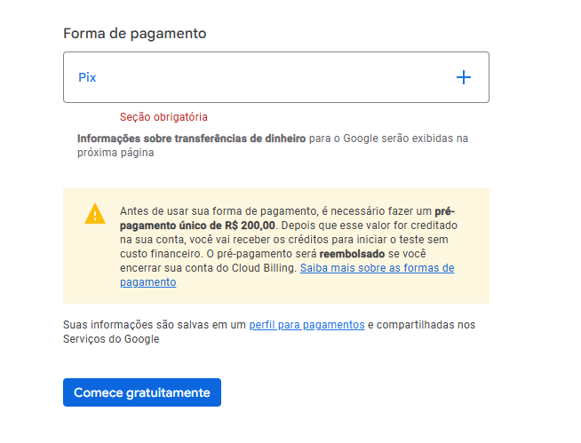

# 📍 Nearby - Guia de Clubes de Benefícios

O **Nearby** é uma aplicação completa (Fullstack) que utiliza geolocalização para listar mercados e estabelecimentos parceiros próximos ao usuário. A aplicação permite filtrar locais por categorias e visualizar detalhes para o resgate de cupons de benefícios através da leitura de QR Codes.

---

## 🛠️ Tecnologias Utilizadas

- **Backend:** Node.js, Express, Prisma (SQLite)
- **Mobile:** React Native, Expo, Axios, React Native Maps
- **Linguagem:** TypeScript

---

## 🚀 Como Executar o Projeto

### 1. Backend
Navegue até a pasta do servidor para configurar o banco de dados:

```bash
cd server

# Instalar dependências
npm install

# Resetar e popular o banco de dados
# Este comando limpa o SQLite e executa o seed.ts (Essencial para evitar erros P2002)
npx prisma migrate reset --force

# Iniciar o servidor
npm run start

cd mobile

# Instalar dependências
npm install

# Iniciar o Expo
npx expo start

### 🗺️ Renderização do Mapa e Google Cloud

Durante o desenvolvimento, identifiquei que o **Google Cloud Maps SDK** exige um faturamento mínimo obrigatório (pré-pagamento) de **R$ 200,00** para liberar a visualização das camadas de ruas, conforme comprovado abaixo:

<p align="center">
  
</p>

**Decisão Técnica:** Para garantir a viabilidade do teste sem custos financeiros, optei por manter o **Provider Nativo**. 
- O código de integração está 100% pronto no arquivo `home.tsx`.
- A lógica de Pins (Marcadores) e consumo de dados da API via Axios está validada.
- Ao rodar o projeto, o mapa utilizará o serviço padrão do sistema (iOS/Android) para exibir a geolocalização dos estabelecimentos retornados pelo backend.